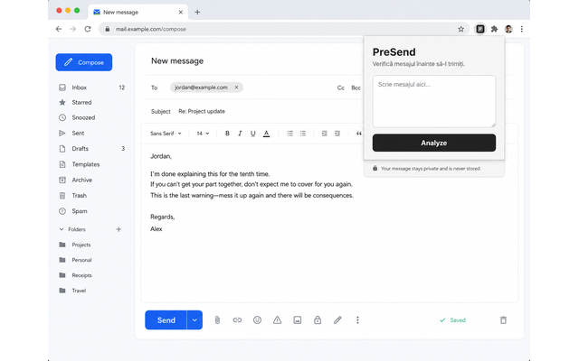

<div align="center">


# PreSend

### Think twice. Send once.

A lightweight browser extension that analyzes Romanian messages before you send them.

[](#)
[](https://www.python.org/)
[](https://fastapi.tiangolo.com/)
[](https://scikit-learn.org/)
[](LICENSE)

</div>

---

## About PreSend

We've all written a message that sounded completely fine in our head and then realized later that it came across much harsher than intended.

**PreSend** was built around a simple idea:

> What if you could quickly check the tone of a message before sending it?

The extension lets you enter a Romanian message and analyzes it using a machine learning model trained for offensive-language classification.

Instead of simply checking for a list of "bad words", the model analyzes patterns in the text and estimates which category best matches the message.

PreSend currently classifies messages into:

- **OTHER** — normal or non-offensive language
- **PROFANITY** — vulgar or profane language
- **INSULT** — insulting or degrading language
- **ABUSE** — strongly offensive or abusive language

The extension also displays confidence scores for every category.

---

## Preview

<!-- Replace this image with a real screenshot from the extension -->

<p align="center">
  
</p>

Example:

```text
Message:
"Ești complet idiot."

Prediction:
INSULT

Confidence:
87.4%

Scores:
INSULT      87.4%
ABUSE        7.2%
PROFANITY    3.1%
OTHER        2.3%
```

---

## How it works

PreSend is made of three main parts:

```text
┌───────────────────────┐
│   Browser Extension   │
│                       │
│   User enters text    │
└──────────┬────────────┘
           │
           │ HTTPS
           ▼
┌───────────────────────┐
│     FastAPI API       │
│                       │
│   /analyze endpoint   │
└──────────┬────────────┘
           │
           ▼
┌───────────────────────┐
│   ML Classification   │
│                       │
│ TF-IDF                │
│ +                     │
│ Logistic Regression   │
└──────────┬────────────┘
           │
           ▼
┌───────────────────────┐
│      Prediction       │
│                       │
│ INSULT       87%      │
│ ABUSE         7%      │
│ PROFANITY     3%      │
│ OTHER         3%      │
└───────────────────────┘
```

The browser extension sends only the text explicitly submitted by the user to the backend.

The backend loads the trained model, performs the prediction and returns the result as JSON.

---

## Machine Learning

The current model uses:

- **TF-IDF vectorization**
- word and bigram features
- **Logistic Regression**
- class balancing
- probability-based predictions

This approach was intentionally chosen for the first version because it is:

- lightweight
- fast
- easy to train on CPU
- easy to deploy
- surprisingly effective for text classification

Example pipeline:

```python
Pipeline([
    (
        "tfidf",
        TfidfVectorizer(
            lowercase=True,
            ngram_range=(1, 2),
            min_df=2,
            max_features=50000,
            sublinear_tf=True
        )
    ),
    (
        "classifier",
        LogisticRegression(
            max_iter=1000,
            class_weight="balanced"
        )
    )
])
```

The trained model is saved using `joblib` and loaded by the FastAPI backend.

---

## Dataset

The model is trained using the Romanian offensive-language dataset:

**`upb-nlp/ro-offense`**

The dataset contains Romanian text labeled using four categories:

```text
OTHER
PROFANITY
INSULT
ABUSE
```

The dataset itself is **not owned by this project**.

PreSend uses it only for training and experimentation according to the dataset's license.

Dataset:

[upb-nlp/ro-offense on Hugging Face](https://huggingface.co/datasets/upb-nlp/ro-offense)

---

## Tech stack

### Machine Learning

- Python
- scikit-learn
- Hugging Face Datasets
- pandas
- joblib
- Jupyter Notebook

### Backend

- Python
- FastAPI
- Uvicorn

### Browser Extension

- HTML
- CSS
- JavaScript
- Chrome Manifest V3

### Infrastructure

- Render — API hosting
- GitHub Pages — Privacy Policy
- GitHub — Source control

---

## Project structure

```text
PreSend/
│
├── backend/
│   └── main.py
│
├── data/
│
├── docs/
│   ├── index.html
│   └── screenshots/
│       └── presend-preview.png
│
├── extension/
│   ├── icons/
│   │   ├── icon16.png
│   │   ├── icon48.png
│   │   └── icon128.png
│   │
│   ├── manifest.json
│   ├── popup.html
│   ├── popup.css
│   └── popup.js
│
├── models/
│   └── message_classifier.joblib
│
├── tests/
│
├── training/
│   ├── download_dataset.ipynb
│   ├── train.ipynb
│   └── predict.ipynb
│
├── .gitignore
├── LICENSE
├── README.md
└── requirements.txt
```

---

## Running PreSend locally

### 1. Clone the repository

```bash
git clone https://github.com/YOUR_USERNAME/PreSend.git
cd PreSend
```

---

### 2. Create a virtual environment

Windows:

```powershell
python -m venv .venv
.\.venv\Scripts\Activate.ps1
```

Linux / macOS:

```bash
python3 -m venv .venv
source .venv/bin/activate
```

---

### 3. Install dependencies

```bash
pip install -r requirements.txt
```

---

## Training the model

The machine-learning workflow is kept inside Jupyter notebooks.

### Download the dataset

Open:

```text
training/download_dataset.ipynb
```

and run the cells.

### Train the model

Open:

```text
training/train.ipynb
```

and run the notebook.

The resulting model should be saved as:

```text
models/message_classifier.joblib
```

### Test predictions

Open:

```text
training/predict.ipynb
```

Example:

```python
predict_message("Salut, ce faci?")
```

or:

```python
predict_message("Ești un idiot.")
```

---

## Running the API

Start the FastAPI backend from the project root:

```bash
uvicorn backend.main:app --reload
```

The API will be available at:

```text
http://127.0.0.1:8000
```

Interactive API documentation:

```text
http://127.0.0.1:8000/docs
```

---

## API

### Analyze a message

```http
POST /analyze
```

Request:

```json
{
  "text": "Ești un idiot."
}
```

Example response:

```json
{
  "text": "Ești un idiot.",
  "label": "INSULT",
  "confidence": 0.874,
  "probabilities": {
    "ABUSE": 0.072,
    "INSULT": 0.874,
    "OTHER": 0.023,
    "PROFANITY": 0.031
  }
}
```

---

## Installing the extension locally

PreSend can be loaded directly into Chromium-based browsers such as:

- Google Chrome
- Brave
- Microsoft Edge

### Chrome

Open:

```text
chrome://extensions
```

### Brave

Open:

```text
brave://extensions
```

Then:

1. Enable **Developer mode**
2. Click **Load unpacked**
3. Select the `extension/` folder
4. Pin PreSend to your browser toolbar
5. Open the extension and analyze a message

---

## Production backend

The public PreSend API is hosted on Render.

Production requests are sent over HTTPS.

```text
Browser Extension
        ↓
HTTPS
        ↓
Render
        ↓
FastAPI
        ↓
ML model
```

Because the service currently uses a free hosting tier, the first request after a period of inactivity may occasionally take longer while the server wakes up.

---

## Privacy

Privacy is especially important for a project that processes messages.

PreSend only analyzes text that the user explicitly submits.

The current version does **not** automatically read:

- browsing history
- passwords
- cookies
- unrelated webpage content
- messages from other websites

Submitted text is sent securely over HTTPS to the PreSend backend for classification.

PreSend does not sell submitted text or use it for advertising.

The application does not intentionally store submitted message content in a persistent application database.

Read the full Privacy Policy:

[PreSend Privacy Policy](https://tudorholota.github.io/PreSend/)

---

## Permissions

PreSend intentionally requests as few browser permissions as possible.

The extension currently requires access only to the PreSend API host so it can:

```text
send submitted text
        ↓
receive classification
        ↓
display result
```

It does not request broad permissions such as:

```text
<all_urls>
tabs
history
cookies
```

when they are not required.

---

## Limitations

PreSend uses machine learning, which means predictions are not guaranteed to be correct.

Language can be difficult to interpret because meaning depends on:

- context
- sarcasm
- slang
- humor
- relationships between speakers
- previous messages
- regional expressions

For example:

```text
"te omor 😂"
```

and:

```text
"știu unde locuiești, te omor"
```

contain similar words but may have completely different meanings.

PreSend should therefore be treated as a helpful signal rather than an absolute judgment.

The final decision always belongs to the user.

---

## Roadmap

Some ideas I would like to explore in future versions:

- [ ] Better Romanian-language classification
- [ ] Larger and more diverse datasets
- [ ] Transformer-based models
- [ ] Aggressiveness detection
- [ ] Threat detection
- [ ] Passive-aggressive language detection
- [ ] Sarcasm detection
- [ ] Context-aware analysis
- [ ] Analysis of multiple previous messages
- [ ] Highlighting problematic parts of a message
- [ ] Suggestions for calmer rewrites
- [ ] Direct integration with supported text fields
- [ ] Improved browser UI
- [ ] Model comparison and benchmarking

The goal is not to turn PreSend into a censorship tool.

The goal is to give people a quick second opinion before they press **Send**.

---

## Why I built this

PreSend started as a way to learn how a real machine-learning product fits together beyond simply training a model.

The project combines:

```text
data collection
      +
machine learning
      +
model evaluation
      +
backend development
      +
API design
      +
browser extensions
      +
deployment
      +
privacy considerations
```

Building the classifier was only one part of the project.

Turning it into something that another person can actually install and use required connecting all of those pieces together.

That is what made PreSend interesting to build.

---

## Contributing

Contributions, suggestions and bug reports are welcome.

If you find a problem or have an idea for improving PreSend, feel free to open an issue.

For larger changes, please open an issue first so the idea can be discussed before implementation.

---

## Disclaimer

PreSend provides automated machine-learning predictions.

The classifications generated by the model should not be interpreted as definitive assessments of a person, message, intent or situation.

The software is provided for informational and experimental purposes.

---

## License

This project is licensed under the **Apache License 2.0**.

See:

[LICENSE](LICENSE)

for more information.

Third-party datasets, libraries and services remain subject to their respective licenses and terms.

---

## Acknowledgements

PreSend makes use of open-source tools and resources including:

- [scikit-learn](https://scikit-learn.org/)
- [FastAPI](https://fastapi.tiangolo.com/)
- [Hugging Face Datasets](https://huggingface.co/docs/datasets/)
- [upb-nlp/ro-offense](https://huggingface.co/datasets/upb-nlp/ro-offense)
- [Render](https://render.com/)

---

<div align="center">

### PreSend

**Think twice. Send once.**

Made with Python, JavaScript and a lot of experimenting.

</div>